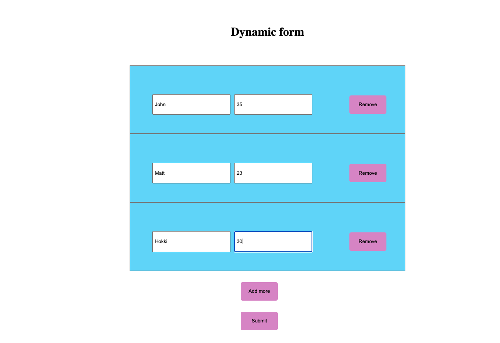

# How to build Dynamic Forms in React

## Steps:

- First create a form in react(static)
- Create `inputFiels` State
- map and add values to the input fields
- add '`Add more`' button and function
- Add `onSubmit` event for form and add `Submit` button and 'onclick' evnt by calling submit function.
- add '`remove`' button and `'removeFields'`functon